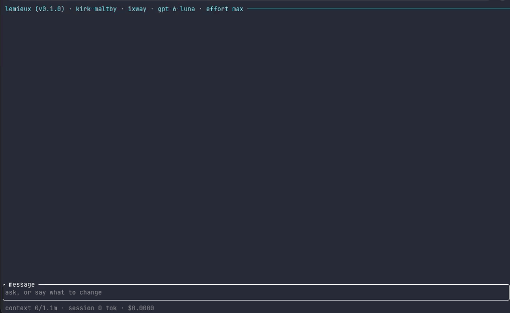

# Releasing Lemieux and lmx

This is the maintainer's procedure. Users install releases as
[Installing and updating lmx](docs/releases.md) describes, and contributors
never need this file.

A release is two things with one version number:

- the `lemieux` package on Hex, with its documentation on HexDocs;
- the GitHub release `vX.Y.Z`: the four native `lmx` archives, the installer,
  `SHA256SUMS` and `update.json`, and the signatures over those two.

CI builds, tests and qualifies. It never signs and never publishes. The
maintainer signs with an offline key and publishes by hand. Commands run from
the repository root unless they start with `cd dist/lmx`.

## What you need

- A clean checkout of `main` with `mise install` done.
- The GitHub CLI (`gh`), signed in with write access to the repository.
- The release signing key, on its encrypted volume.
- A Hex account with two-factor authentication; `mise exec -- mix hex.user whoami`
  shows it.
- Clean machines or virtual machines for macOS and Linux, and Windows when
  you can, to try the release as a user would.

## The release signing key

Every release signs two files with one Ed25519 key: `SHA256SUMS`, which
`install.py` checks, and `update.json`, which every installed `lmx` checks
before it installs an update. The public half is compiled into each build and
pinned in `scripts/install.py`. Anyone who holds the private half can sign an
update that every installed `lmx` installs on its own, so it never touches a
machine you do not trust, CI included.

Only the maintainer runs `mix lmx.release.keygen`, `mix lmx.release.sign` and
`mix lmx.release.sign_draft`. Agents and CI never run them, and tests use
throwaway keys ([AGENTS.md](AGENTS.md) and [CONTRIBUTING.md](CONTRIBUTING.md)
say the same).

### Generate it once

On a trusted machine, with the encrypted volume mounted:

```sh
cd dist/lmx
mise exec -- mix lmx.release.keygen --private-key /Volumes/LMX-KEYS/lmx-release.key
```

`keygen`:

- writes the private key with mode 0600, through a private staging directory:
  one `#` comment line, then the base64 of the 32-byte Ed25519 seed;
- never prints it, and never overwrites an existing file;
- refuses a path inside any Git working tree, and warns when the file system
  ignores file modes (FAT, exFAT);
- prints the public key, and writes it to `dist/lmx/release-signing.pub` and
  to the `RELEASE_PUBLIC_KEY` line of `scripts/install.py`.

Commit those two files together, before the first signed tag; tests check
that they agree with each other and with the key compiled into `lmx`. Then
put the public key in [SECURITY.md](SECURITY.md#release-signing-key), in the
README's install section and in `.github/release-notes.md`, so users can
compare copies ([Owner placeholders](#owner-placeholders)).

While `release-signing.pub` is missing or `UNSET`, a tag build stops at its
first step ("No release signing key is committed. Run mix lmx.release.keygen
first (see RELEASING.md).") and a manual run only warns. Any run stops when
the file is malformed or differs from `install.py`.

### Keep it offline

- Keep the key on an encrypted removable volume (APFS encrypted, LUKS or
  VeraCrypt; not bare FAT or exFAT), with a second encrypted copy somewhere
  else.
- Never put it in a Git checkout (the tasks refuse), a synced folder, a CI or
  Actions secret, a shared password vault, a chat or a terminal scrollback.
- Mount it only to sign, and eject it afterwards.

### Files and formats

| File | Contents |
| --- | --- |
| `dist/lmx/release-signing.pub` | One line: the padded base64 of the 32-byte public key, or `UNSET` |
| `NAME.sig` | The padded base64 of the 64-byte Ed25519 signature over `NAME`'s exact bytes, and a newline |

Only `SHA256SUMS` and `update.json` are signed; the archives are covered by
their digests in both.

Two lower-level tasks run from `dist/lmx`:
`mix lmx.release.sign --private-key PATH [--public-key BASE64] FILE...`
writes `FILE.sig` and refuses a key that does not match
`release-signing.pub` unless `--public-key` names the expected key;
`mix lmx.release.verify [--public-key BASE64] FILE...` needs no private key
and lists every file that fails.

### Rotate, lose or leak it

**Planned rotation, with the old key still at hand:**

1. Generate and pin the new key:
   `mix lmx.release.keygen --rotate --private-key /Volumes/LMX-KEYS/lmx-release-NEW.key`.
   `keygen` refuses without `--rotate` while a key is pinned. Commit
   `release-signing.pub` and `scripts/install.py`, and build release N from
   that commit: its builds and its `install.py` pin the new key. Release CI
   verifies release N-1 with the key pinned at N-1's own tag, the key that
   signed it, so the new pin does not stop the build.
2. Sign release N by hand, because installed builds older than N trust only
   the old key, while N's `install.py` checks `SHA256SUMS.sig` with the new
   one (`sign_draft` would sign both files with the new key):

   ```sh
   gh release download vN --repo houllette/lemieux --pattern SHA256SUMS --pattern update.json --dir /tmp/n
   cd dist/lmx
   mise exec -- mix lmx.release.sign --private-key NEW.key /tmp/n/SHA256SUMS
   mise exec -- mix lmx.release.sign --private-key OLD.key --public-key OLD_PUB /tmp/n/update.json
   mise exec -- mix lmx.release.verify /tmp/n/SHA256SUMS
   mise exec -- mix lmx.release.verify --public-key OLD_PUB /tmp/n/update.json
   gh release upload vN /tmp/n/SHA256SUMS.sig /tmp/n/update.json.sig --clobber --repo houllette/lemieux
   ```

3. Leave N as the latest release long enough for running installations to
   take it; they check hourly while the terminal UI is open.
4. From N+1 on, sign with `sign_draft` and the new key as usual.
5. A build older than N that missed N checks N+1 with the old key and reports
   "failed signature verification ... may have been tampered with". N+1's
   release notes must tell those users to reinstall with `install.sh`.

**Lost key:** installed builds can never verify another update. Pin a new key
(`keygen --rotate`), release, and tell users to reinstall with `install.sh`.
There is no way to reach them through the updater.

**Leaked key:** publish a security advisory, then rotate. A rotation release
signed with the leaked key is still the only way to reach installed builds.
Advise `LMX_AUTO_UPDATE=0` or `LMX_CHECK_UPDATES=0` until users have
reinstalled from an `install.sh` that pins the new key.

After any of the three, a release from before the change verifies only with
the old key. Release CI checks each previous release with the key its own tag
pins, so the change does not stop a build, but `install.sh` runs the latest
`install.py`, which refuses such a release and says how to install it: with
that release's own installer, as
[docs/releases.md](docs/releases.md#recovery-and-rollback) shows. Say so in
the notes of the first release after the change. After a leaked key, a
release signed with it proves less than it did; tell people to check such an
archive with `gh attestation verify` as well.

## Owner placeholders

Five values only the maintainer can supply stand in the tree as a
placeholder token until then: `REPLACE_BEFORE` and `_LAUNCH` joined, written
apart here so that this file does not match itself.
`scripts/check_public_text.sh` fails while any is left, and a tag build's
wording check blocks on it.

| Where | What goes there |
| --- | --- |
| `README.md`, the install section | The release-signing public key, as `keygen` printed it |
| `SECURITY.md`, [Release signing key](SECURITY.md#release-signing-key) | The same key |
| `.github/release-notes.md`, below the platform table | The same key |
| `.github/release-notes.md`, the macOS Apple Silicon row | The minimum macOS version the macOS archives declare, which the macOS build jobs record in their summaries ([step 2](#2-rehearse-with-a-manual-run)) |
| `CODE_OF_CONDUCT.md`, Reporting an Issue | The address that receives conduct reports |

The three copies of the key must equal `dist/lmx/release-signing.pub`. The
minimum macOS version belongs to each release: check it again every time
([step 1](#1-prepare-the-release-commit)).

## Cut a release

### 1. Prepare the release commit

- Bump `VERSION` and the `@version` literal in `mix.exs` together; a test
  checks the pair.
- In `CHANGELOG.md`, turn the `## Unreleased` section (for 0.8.0,
  `## 0.8.0 — unreleased`) into the version's dated section:
  `## X.Y.Z — YYYY-MM-DD`. After an update, the terminal UI links the
  changelog as it is at the version's tag.
- Rewrite `.github/release-notes.md` as this release's GitHub release body:
  what changed for users, how to install, and, for an update, whether
  installed copies apply it live or need a restart and a resume. State the
  minimum macOS version the macOS archives declare, which the macOS build jobs
  record in their summaries; the rehearsal in step 2 confirms it. No
  qualification records: those go in a comment on the release pull request
  ([Qualification](#qualification)).
- Commit the reviewed upgrade decision, `dist/lmx/upgrades/X.Y.Z.exs`
  ([Upgrade decisions](#upgrade-decisions)).
- Regenerate `test/fixtures/harness_learning/contracts.json`. Its harness
  snapshot records the Lemieux version, so every bump moves the version and
  three digests in it (the snapshot's manifest and semantic digests and the
  run evidence digest), and the golden contracts test fails until they move:
  `mix test test/lemieux/learning/golden_contracts_test.exs` shows the new
  values. Change only those, so the file keeps its layout.
- Run `mise exec -- mix precommit.full` (it needs network access and
  `python3`).
- Check that no placeholder or private wording is left. The placeholder
  token is split in two below so that this file does not match itself:

  ```sh
  git grep -n 'REPLACE_BEFORE''_LAUNCH'    # must print nothing
  scripts/check_public_text.sh
  python3 scripts/check_links.py
  ```

- Merge through a pull request whose required checks are green.

### 2. Rehearse with a manual run

```sh
gh workflow run release.yml --repo houllette/lemieux --ref main
gh run watch --repo houllette/lemieux "$(gh run list --repo houllette/lemieux --workflow release.yml --limit 1 --json databaseId -q '.[0].databaseId')"
```

A manual run builds and qualifies every archive and uploads the
`complete-release-candidate` artifact. It creates no release and attests
nothing, and its link and wording checks only report. Check the minimum macOS
version in the macOS jobs' summaries against the release notes, and fix the
notes before tagging if they differ.

Then run the human checks in [Qualification](#qualification) on this run's
archives, on each platform you can. Download the artifact (`RUN_ID` is the
manual run's id) and install each archive into a fresh prefix with
`install.py`'s local mode:

```sh
rehearsal=$(mktemp -d) prefix=$(mktemp -d)
gh run download RUN_ID --repo houllette/lemieux --name complete-release-candidate --dir "$rehearsal"
cd "$rehearsal"
python3 install.py lmx_macos_silicon.tar.gz --checksums SHA256SUMS --prefix "$prefix"
"$prefix/bin/lmx" --version
```

The archives have no signature yet, and the installer says so. Fix anything
that fails and rehearse again before you tag: until the tag, a mistake costs
a new commit, not a new version.

### 3. Tag

Tag the commit the rehearsal built. The tag must be `v` followed by the
contents of `VERSION`:

```sh
git switch main && git pull --ff-only
git rev-parse HEAD    # the commit the rehearsal run built
git tag -a vX.Y.Z -m "Lemieux X.Y.Z"
git push origin vX.Y.Z
```

The tag run builds a draft pre-release and, at the end, prints the check,
sign, verify and publish steps below in its summary, with the run's id
filled in.

### 4. Check the draft and record the qualification

`sign_draft` cannot tell whether the draft holds what the tagged run built,
so compare them first:

```sh
dir=$(mktemp -d)
gh run download RUN_ID --repo houllette/lemieux --name complete-release-candidate --dir "$dir/run"
gh release download vX.Y.Z --repo houllette/lemieux --dir "$dir/draft"
diff -r "$dir/run" "$dir/draft" && echo "draft matches run RUN_ID"
```

Then post the qualification record ([Qualification](#qualification)) as a
comment on the release pull request, with the final archive checksums from
the draft's `SHA256SUMS`. Sign only after the human checks passed and the
record is posted.

### 5. Sign

Mount the key, then:

```sh
cd dist/lmx
mise exec -- mix lmx.release.sign_draft --tag vX.Y.Z --private-key /Volumes/LMX-KEYS/lmx-release.key
```

`sign_draft`, in order:

- refuses a release that is not a draft (`gh release view --json isDraft,isPrerelease`);
- checks that the private key belongs to `release-signing.pub`;
- downloads `SHA256SUMS`, `update.json` and `install.py`;
- checks that `update.json` names X.Y.Z; that `update.json` and `SHA256SUMS`
  list the same `lmx_TARGET.tar.gz` archives with the same SHA-256, each entry
  valid for the updater; that `SHA256SUMS` lists the exact `update.json` and
  `install.py`; and that `install.py` pins the same key;
- signs `SHA256SUMS` and `update.json`, uploads `SHA256SUMS.sig` and
  `update.json.sig`, downloads them again and verifies them.

It never publishes. When the draft is marked as a pre-release, it prints a
note. `--repo OWNER/NAME` signs a fork's draft instead.

### 6. Verify

Still in `dist/lmx`:

```sh
gh release download vX.Y.Z --repo houllette/lemieux --dir "$dir/signed"
mise exec -- mix lmx.release.verify "$dir/signed/SHA256SUMS" "$dir/signed/update.json"
(cd "$dir/signed" && shasum -a 256 -c SHA256SUMS)
for file in "$dir"/signed/lmx_*.tar.gz "$dir/signed/SHA256SUMS" "$dir/signed/update.json"; do
  gh attestation verify "$file" --repo houllette/lemieux --source-ref refs/tags/vX.Y.Z \
    --signer-workflow houllette/lemieux/.github/workflows/release.yml
done
```

Then eject the key.

### 7. Publish to Hex

Follow [Publish to Hex](#publish-to-hex). It comes before the GitHub release
because its checks can still stop the release: a problem found in the
package needs a new version, and nothing is public yet. Do steps 7 and 8 in
one sitting, because each side links the other: the release notes link the
package on hex.pm and its HexDocs, and HexDocs shows the install command,
which reads the latest GitHub release.

### 8. Publish the GitHub release

Read the draft once more: the body is `.github/release-notes.md`, and the
minimum macOS version in it must match what the macOS jobs recorded. Check
that it carries both signatures, because publishing makes it immutable and an
unsigned release cannot be fixed afterwards
([Re-runs and mistakes](#re-runs-and-mistakes)). Then publish it as the
latest release, not as a pre-release:

```sh
gh release view vX.Y.Z --repo houllette/lemieux --json assets \
  -q '[.assets[].name | select(. == "SHA256SUMS.sig" or . == "update.json.sig")] | length'    # must print 2
gh release edit vX.Y.Z --repo houllette/lemieux --draft=false --prerelease=false --latest
```

`install.sh` and every installed `lmx` read GitHub's latest release, which
skips drafts and pre-releases. A stable release must carry all four archives;
`scripts/release_checksums.py` refuses an incomplete set, so the workflow
cannot produce one.

Then, through a pull request, open an empty `## Unreleased` section at the
top of `CHANGELOG.md`: it is where contributors add the next version's
lines ([CONTRIBUTING.md](CONTRIBUTING.md)).

### 9. Try it like a user

On a clean macOS machine and a clean Linux machine:

```sh
curl -fsSL https://github.com/houllette/lemieux/releases/latest/download/install.sh | sh
~/.local/bin/lmx --version
```

The installer must print "Signature and checksum verified". Open `lmx`, run
one prompt with a test account, and quit. Where an earlier release is
installed, leave its terminal UI open and check that it takes the update
within the hour.

### Re-runs and mistakes

- Re-running a tag's workflow replaces every draft asset, signatures included.
  Check, sign and verify again, with the new run's id in step 4.
- A published release is never rebuilt; the draft job refuses it. Fix a
  mistake with a new version.
- A release published before it was signed can never be signed: immutable
  releases refuse new assets and `sign_draft` refuses a published release,
  while `install.sh` refuses it ("this release has no SHA256SUMS.sig") and
  installed copies report it as not signed yet. Make the previous release
  Latest again, which `install.sh`, the updater and release CI all read, and
  mark the unsigned one a pre-release; then release the same code as the next
  patch version, with its upgrade decision from the previous release:

  ```sh
  gh release edit vPREVIOUS --repo houllette/lemieux --latest
  gh release edit vX.Y.Z --repo houllette/lemieux --prerelease
  ```

  0.9.0 went out this way, and 0.9.1 is the same code, signed.
- Any change to the signed bytes after signing (a rebuild, a re-upload,
  operating-system code signing) means new `SHA256SUMS` and `update.json` and
  signing again.

## What the release workflow does

`.github/workflows/release.yml` runs on `v*` tags and by hand
(`workflow_dispatch`):

| Job | What it does |
| --- | --- |
| Validate release candidate | Requires the signing key (tags only), the tag to match `VERSION`, clean links and wording (blocking on tags), `mix ci`, a reviewed upgrade decision against GitHub's latest stable release, the distributed suite, the recorded evaluation, and the Hex package compiled as a dependency. Nothing is published |
| Previous stable release | Downloads the latest stable release's archives and checksums, which upgrade paths start from |
| linux (static OTP, ubuntu:22.04) | Builds Erlang/OTP with a static OpenSSL in an `ubuntu:22.04` image pinned by digest (tag builds compile it from checksum-verified sources; manual runs may reuse a cache), tests the release host, builds the archive |
| linux (qualify the archive) | Runs the release smoke tests on the archive as an ordinary user |
| linux on IMAGE | Runs `lmx --version` (nothing on stderr) and `lmx help models` in clean Fedora, Rocky Linux 9, Amazon Linux 2023, openSUSE Tumbleweed, Debian 12 slim and Ubuntu 24.04 images, without network |
| macOS arm64, macOS x86-64, Windows x86-64 | Build, test and qualify each archive on its own runner (`macos-15`, `macos-15-intel`, `windows-2025`); macOS jobs record the minimum macOS version, the Windows job starts `bin\lmx.cmd` from `cmd.exe` |
| Assemble complete candidate | Collects the archives and their qualification reports with `LICENSE`, `NOTICE`, `.github/release-notes.md`, the installer and the upgrade plan; `scripts/release_checksums.py` writes `update.json` and `SHA256SUMS` and refuses a missing archive or an entry the updater would reject |
| Attest build provenance | Tag builds of the public repository only: provenance attestations for the archives, `SHA256SUMS` and `update.json` |
| Draft release | Tag builds only: creates or refreshes a draft pre-release, refuses a published one, and prints the maintainer's next steps |

No job publishes a release, and no job signs anything.

## Upgrade decisions

Every version needs a reviewed `dist/lmx/upgrades/VERSION.exs`, committed with
the version bump and before tagging. It decides, per platform, whether an
installed `lmx` takes the release live (`:hot`) or at its next start
(`:restart`). CI rejects a missing or unreviewed decision, a predecessor
other than GitHub's latest stable release, a missing platform, and a hot
archive that was not qualified.

| Decision | When | Predecessor | relup |
| --- | --- | --- | --- |
| `:initial` | Only while no stable release exists; CI checks this | None | None |
| `:restart` | Windows always; any change to the runtime, dependencies, native assets or static configuration; state, messages or retained callbacks that cannot survive; any doubt | The latest stable release | None; record a concrete reason |
| `:hot` | Changed modules whose state, messages, callbacks and rollback were reviewed | The latest stable release and its exact `build_id` for that platform | Required, with upgrade and downgrade instructions |

On Linux, a hot path also needs the previous tag build's "OTP application
digest", printed in its job summary, to match the new build's; otherwise the
build stops with "runtime, dependencies or native assets changed; review a
restart decision". Until two builds from scratch have been compared, treat
Linux as restart.

Some changes need a restart however small their module diff:

- **`Lemieux.TUI.Signals` and `Lemieux.CLI.TUI`.** Their SIGTERM traps are
  local functions that the signal server holds while a screen runs, and,
  once one has fired, until the VM stops. Soft purge does not protect a
  stored function: in a test VM, a trap whose module was replaced and purged
  raised `BadFunctionError`, and the VM exited 0 with nothing cancelled.
  `Lmx.Boot`'s own trap and exit hook are external function references and
  survive a hot upgrade.
- **Anything `Lmx.Boot.main/0` records once at boot**, such as the
  environment the agent's commands inherit (`Lmx.CLI.inherit/1`). A VM that
  took the new code live keeps what its own boot recorded until it restarts.

From `dist/lmx`, on each platform's own machine:

1. Download the latest stable release's archives, `SHA256SUMS` and
   `SHA256SUMS.sig`. Verify the signature with the key pinned at that
   release's tag, as release CI does (after a key change the checkout's own
   pin is a different key), then unpack each archive into a
   fresh directory, never a hot-updated installation; `unpack` checks the
   archive against `SHA256SUMS`:

   ```sh
   gh release download vPREVIOUS --repo houllette/lemieux \
     --pattern 'lmx_*.tar.gz' --pattern 'SHA256SUMS*' --dir /tmp/previous-download
   mise exec -- mix lmx.release.verify \
     --public-key "$(git show vPREVIOUS:dist/lmx/release-signing.pub)" /tmp/previous-download/SHA256SUMS
   mise exec -- mix lmx.upgrade.unpack --archive /tmp/previous-download/lmx_macos_silicon.tar.gz \
     --checksums /tmp/previous-download/SHA256SUMS --output /tmp/previous
   ```

2. Build an inspection candidate, then draft the decision. The draft is
   unreviewed, and the task prints a JSON diff of changed modules:

   ```sh
   MIX_ENV=prod mise exec -- mix release --overwrite
   mise exec -- mix lmx.upgrade.draft --from /tmp/previous \
     --to _build/prod/rel/lmx --output upgrades/X.Y.Z.exs
   ```

3. Review it as [dist/lmx/upgrades/AGENTS.md](dist/lmx/upgrades/AGENTS.md)
   describes, set `reviewed: true`, and commit it. A module diff locates the
   review work; it never proves state compatibility.
4. Check the plan and build against the exact predecessor:

   ```sh
   mise exec -- mix lmx.upgrade.check --latest PREVIOUS --target macos_silicon
   LMX_TARGET=macos_silicon LMX_REQUIRE_UPGRADE_PLAN=1 \
     LMX_UPGRADE_FROM=/tmp/previous MIX_ENV=prod \
     mise exec -- mix release --overwrite
   ```

   For a hot target, check the build tree and the final archive for nonempty
   `releases/X.Y.Z/relup`, `lib/lemieux-X.Y.Z/ebin/lemieux.appup` and
   `lib/lmx-X.Y.Z/ebin/lmx.appup`, naming the exact predecessor in both the
   upgrade and downgrade lists, and for `release.json`'s `upgrade_from` and
   `hot_modules` matching the plan. Restart and initial archives carry no
   relup and empty `upgrade_from` and `hot_modules`. Change the plan, never
   the generated files.
5. Qualify the actual old and new archives (omit `--expect-hot` for a restart
   path) and keep the report:

   ```sh
   python3 ../../test/release_upgrade_smoke.py \
     --from /tmp/previous-download/lmx_macos_silicon.tar.gz --to _build/prod/lmx-X.Y.Z.tar.gz \
     --expect-hot --report /tmp/upgrade-report-macos_silicon.json
   ```

   If qualification fails, fix and rebuild, or commit a reviewed restart
   decision and qualify that. Never publish an unqualified archive as hot.

[dist/lmx/upgrades/README.md](dist/lmx/upgrades/README.md) describes the plan
file, and the release workflow repeats the qualification on every platform.

## Qualification

Release CI runs every archive with a scripted provider and no model calls:
`test/release_session_smoke.py` (real tools, resume across processes, the
license files, nothing on stderr from `--version` and `help`, a working
directory's `.env` ignored, and on Unix a command the agent runs getting the
person's environment and their own `erl`, and Ctrl-C, a closed terminal,
`SIGTERM` and a killed launcher cancelling a running turn with statuses 130,
129 and 143), `test/release_extension_smoke.py`,
`test/release_stdin_smoke.py`, and `test/release_upgrade_smoke.py`, which
updates through a synthetic series of releases and, once a stable release
exists, from the actual previous archive.

CI cannot judge a terminal or a provider account. Before tagging, on the
rehearsal's archives ([step 2](#2-rehearse-with-a-manual-run)) and on clean
machines, for each platform you can, check:

- installation with `install.py`'s local mode (on Windows, unpacking and
  `bin\lmx.cmd`), `lmx --version`, `lmx explain`, and a session with no key
  (the provider panel);
- the terminal UI: starting and quitting with the terminal restored, resizing,
  selecting text, multi-line input, cancelling and resuming;
- a bounded tool loop with an authorized test account, naming the provider
  and model (a scripted run is a separate result);
- rebuilding and loading an extension, starting with a missing one, and
  resuming a transcript from the previous release (keep that fixture for
  later releases).

`install.sh` itself can only be tried once the release is published
([step 9](#9-try-it-like-a-user)).

Record, in a comment on the release pull request (it can be added after
merging) and never in the release notes: the commit; for each platform, the
upgrade decision and its reason, a hot path's predecessor build id, the CI
qualification report, the final archive SHA-256 from the draft, and the
SHA-256 of the archive you tested; the CI runs; the tester and date; and the
test account or model, never credentials.

## Operating-system code signing

The macOS archives are not signed or notarized by Apple, and the Windows
archive is not Authenticode-signed; the docs say so. Release signing does not
depend on it. If operating-system signing is ever added, it has to happen
before `scripts/release_checksums.py` writes the checksums, and it changes the
archives' bytes, so the qualification reports, which are bound to the archive
digests, must be produced again. Never commit signing certificates or keys.

## Publish to Hex

`mix hex.build` and ExDoc read the working tree: `lib` and `docs/**/*.md` are
collected from disk, so an untracked or ignored file in your own checkout
would be published. Publish from a fresh clone of the tag:

1. Clone the tag:

   ```sh
   git clone --branch vX.Y.Z --depth 1 https://github.com/houllette/lemieux.git /tmp/lemieux-vX.Y.Z
   cd /tmp/lemieux-vX.Y.Z
   mise install && mise exec -- mix deps.get
   git status --short --ignored    # nothing but deps/ and _build/
   ```

2. Build the package and compare its files with what Git tracks:

   ```sh
   mise exec -- mix hex.build --unpack --output /tmp/lemieux-pkg
   (cd /tmp/lemieux-pkg && find . -type f | sed 's|^\./||' | sort) > /tmp/pkg-files
   git ls-files | sort > /tmp/git-files
   comm -23 /tmp/pkg-files /tmp/git-files    # only hex_metadata.config
   ```

3. Check the packaged files for placeholders, private names and launch-state
   wording, with the same script CI runs:

   ```sh
   grep -rn 'REPLACE_BEFORE''_LAUNCH' /tmp/lemieux-pkg    # must print nothing
   check=$(mktemp -d)
   cp -R /tmp/lemieux-pkg/. "$check" && mkdir -p "$check/scripts"
   cp scripts/check_public_text.sh "$check/scripts/"
   (cd "$check" && git init -q && git add -A && scripts/check_public_text.sh)
   ```

4. Rehearse: `mise exec -- mix hex.publish --dry-run` builds the package and
   the documentation and publishes nothing. Open `doc/index.html` and check
   the landing page and the sidebar. hex.pm limits the size of the
   documentation it accepts.
5. Publish: `mise exec -- mix hex.publish`. At the prompt, check the name
   (`lemieux`), the version, the description, the license (`Apache-2.0`),
   `ex_ratatui` listed as optional, Elixir `~> 1.19`, and the links. Keep the
   `"GitHub"` link: `Lemieux.CLI.UpdateCheck.fetch/1` accepts Hex's answer only
   when it names this repository. HexDocs "view source" links point at the
   tag, `vX.Y.Z` (`LEMIEUX_DOCS_REF` overrides it).
6. Check it like a newcomer: in a new Mix project, add `{:lemieux, "~> X.Y"}`,
   run `mix deps.get` and `mix compile`, and run the program from
   [First embedded agent](docs/first-embedded-agent.md). Check that
   hex.pm/packages/lemieux shows the right links and that hexdocs.pm/lemieux
   opens on the overview.

A package's first version can be reverted within 24 hours of publishing it,
and later versions within one hour: `mix hex.publish --revert X.Y.Z`. After
that a version can only be retired (`mix hex.retire lemieux X.Y.Z REASON
--message "..."`). The documentation can be published again at any time with
`mix hex.publish docs`, from the tag's clone.

## Platform and dependency upkeep

- **OpenSSL is compiled into the Linux archive.** An OpenSSL security release
  needs a new `lmx` release with `OPENSSL_VERSION` and its checksum bumped in
  `scripts/build-static-otp.sh`. The script's header shows how to run the
  release build's static Erlang/OTP build locally in Docker; on Apple
  Silicon it needs `-e ERL_FLAGS='+JMsingle true'`, which does not change
  what it builds.
- **Toolchain bumps.** A new Erlang or Elixir in `.tool-versions` needs its
  source checksums in that script's `pinned_sha256`; CI's Lint workflows job
  runs `scripts/build-static-otp.sh --check-pins` and fails until it has them.
  An Erlang/OTP bump also needs `Lmx.Notices`' reviewed version and component
  list checked against OTP's `vendor.info`: the build refuses any other OTP.
- **Third-party notices.** An `ex_ratatui` or `Cargo.lock` change needs
  `cd dist/lmx && mise exec -- elixir notices/generate_crates.exs` (it needs
  `cargo` and network access) and a review of the diff; the build and the
  notices test refuse a mismatch, so Dependabot's bumps fail until then. A
  `yaml_elixir` bump needs `notices/hex/yaml_elixir-VERSION.txt`. A new Hex
  dependency without a license file (unless it is Apache-2.0) or with an
  unknown license name stops the build.
- **Archive checks.** The build fails when an archive lacks `LICENSE`,
  `NOTICE` or `THIRD_PARTY_NOTICES`, ships `releases/COOKIE` or
  `releases/RELEASES`, or carries anything but exactly one process-helper
  binary.
- **Runners and images.** The Linux build image is pinned by digest in
  `release.yml`; macOS builds run on `macos-15` and `macos-15-intel`, Windows
  on `windows-2025`. Move them before GitHub retires them.

[The release host README](dist/lmx/README.md) covers local builds, tests and
the notices inputs.

## Repository settings

### Required checks

The `main` branch ruleset requires these status checks. The names are the
jobs' `name:` fields. Renaming a job therefore leaves the old check required
and forever pending, which blocks every merge, while the new name is not
required at all: update the ruleset in the same change.

- From `ci.yml`: `Lint & test`, `Elixir floor (1.19 / OTP 28)`, `Dialyzer`,
  `Hex package (pinned)`, `Hex package (floor Elixir 1.19.0 / OTP 27.0)`,
  `Example builder`, `Example capture`, `Example computer_use`,
  `Example research`, `Example review`, `Example security`,
  `Example systemone_compaction`, `Example verifier`, `Standalone release host`,
  `Docs links`, `Public wording` and `Lint workflows`.
- From `public-readiness.yml`: `Tutorial and release helpers`,
  `Commit identities` and `Secret scan (full history)`.

`Security` (the dependency audits) turns red when an advisory is published,
whatever the pull request changed; require it only if you want merges to wait
until advisories are handled. Do not require `Submit Mix dependencies`.
`Commit identities` refuses commits whose author or committer address is not a
GitHub noreply address, contributors' included.

### Launch checklist

Run the first part before the repository's history becomes public: at the
launch, and again before publishing any rewritten history or a new public
mirror. Everything reachable becomes public at once, and pull-request heads
stay public even after their branches are deleted or rewritten; only GitHub
Support can remove them.

**Before the history goes public**

- List every author and committer address in reachable history, and expect
  only GitHub noreply addresses (the Commit identities check covers new
  commits only):

  ```sh
  git log --all --format='%ae%n%ce' | sort -u
  ```

- Scan everything GitHub will serve, pull-request heads included, through a
  mirror clone, with archives opened, using the gitleaks version
  `public-readiness.yml` pins, checksum-verified:

  ```sh
  git clone --mirror https://github.com/houllette/lemieux.git /tmp/lemieux-mirror
  cd /tmp/lemieux-mirror
  git log --all --format='%ae%n%ce' | sort -u
  gitleaks git --log-opts="--all" --max-archive-depth 5 --redact .
  ```

- Decode payloads a scanner cannot read, such as gzip-compressed base64
  embedded in generated HTML reports, and scan the result.
- Review what no scanner can judge: transcripts, benchmark inputs, internal
  host names and prose, for permission to publish.
- Review access: collaborators (write access can push `v*` tags, which start
  the release workflow, and edit draft releases), deploy keys, GitHub Apps
  installed on the repository, and the Hex account's two-factor
  authentication.
- Never push the whole local repository (`git push --all` or `--mirror`) from
  a working checkout.
- To replace the README demo, `docs/assets/lmx-preview.gif` (a recording
  from before the first release), record a new one. A new take should avoid
  a directory listed with `ls -la` (which prints the owner's account name),
  pre-release wording and an unexplained unknown cost. From the repository
  root, with one public provider's key exported and a model whose price
  ReqLLM knows (the tape's header lists everything it needs):

  ```sh
  rm -rf /tmp/lmx-preview-home && mkdir /tmp/lmx-preview-home
  mkdir -p docs/assets
  vhs scripts/lmx-preview.tape
  ```

  Inspect every frame, not only the last, for example after
  `mkdir /tmp/lmx-frames && ffmpeg -i docs/assets/lmx-preview.gif /tmp/lmx-frames/%04d.png`:
  no user name or home path, no `ls -la` listing, no pre-release or
  launch-state wording, a cost rather than `estimated cost: unknown (...)` on
  the status line, and a header that shows the directory
  (`lemieux (vX) · ~/greet · ...`). Then update the image's alt text in
  README.md, after the paragraph that introduces Lemieux, to match what the
  new recording shows:

  ```markdown
  
  ```

  The same run writes `tmp/lmx-social-preview.png` for the social preview
  (item 9 below).
- Generate the release key ([Generate it once](#generate-it-once)) and fill
  the [owner placeholders](#owner-placeholders) you can: the three copies of
  the key and the Code of Conduct contact. The minimum macOS version comes
  from the first release run (item 11 below). The Public wording check fails
  on every push and pull request while any of the five is left.

**Right after the repository goes public**, in the same sitting:

1. Private vulnerability reporting, which SECURITY.md depends on:

   ```sh
   gh api -X PUT repos/houllette/lemieux/private-vulnerability-reporting
   gh api repos/houllette/lemieux/private-vulnerability-reporting    # {"enabled":true}
   ```

   Then open https://github.com/houllette/lemieux/security/advisories/new
   from another account and check that the form appears.
2. Secret scanning and push protection; a visibility change does not turn
   them on:

   ```sh
   gh repo edit houllette/lemieux --enable-secret-scanning --enable-secret-scanning-push-protection
   gh api repos/houllette/lemieux --jq .security_and_analysis
   ```

3. Rulesets (Settings, Rules, Rulesets): one for `main` (no deletion, no force
   push, a pull request required, the [required checks](#required-checks),
   squash merges only) and one for `v*` tags (only administrators create, move
   or delete them, so only they can start a release). Check them with
   `gh ruleset check main -R houllette/lemieux`.
4. Immutable releases, before the first tag, so published assets cannot be
   replaced; drafts stay editable for signing:
   `gh api -X PUT repos/houllette/lemieux/immutable-releases`.
5. Merge settings: squash merges titled from the pull request, and delete
   head branches after merging.
6. Discussions on, with Q&A, Ideas, Show and tell and Announcements; wiki and
   projects off.
7. Actions: require approval to run workflows from first-time contributors'
   forks, and keep the default `GITHUB_TOKEN` read-only:

   ```sh
   gh api -X PUT repos/houllette/lemieux/actions/permissions/fork-pr-contributor-approval \
     -f approval_policy=first_time_contributors
   gh api repos/houllette/lemieux/actions/permissions/workflow
   ```

8. Dependabot: alerts on, security updates off. The dependency graph also
   reads the fixture manifests under `eval/corpus`, which security-update pull
   requests would edit; the `Submit Mix dependencies` workflow reports the
   real Hex dependencies.
9. Description, topics, a 1280×640 social preview image, and, once the
   documentation is on HexDocs, the homepage:
   `gh repo edit houllette/lemieux --homepage https://hexdocs.pm/lemieux`.
10. Look at it as a stranger: signed out, the README renders, the issue forms
    and contact links appear, and the Security tab shows the policy and a
    **Report a vulnerability** button. `gh api
    repos/houllette/lemieux/community/profile` lists the community files.
11. Run the Nightly workflow, then dispatch the release workflow on this
    repository and watch it to the end, as in
    [step 2](#2-rehearse-with-a-manual-run). `release.yml` has never run:
    this run is the first proof of its jobs, runners, images and permissions
    here, and its macOS jobs' summaries give the minimum macOS version for
    the release notes. Fix anything red, and fill that last placeholder,
    before the first tag. Watch the `linux on opensuse/tumbleweed` leg: it
    fails when `lmx --version` writes anything to standard error, and the
    bare Tumbleweed image has been seen without `awk`, which makes every
    start print `awk: command not found`. Assemble needs every leg, so if it
    fails that way, fix that job before tagging.
